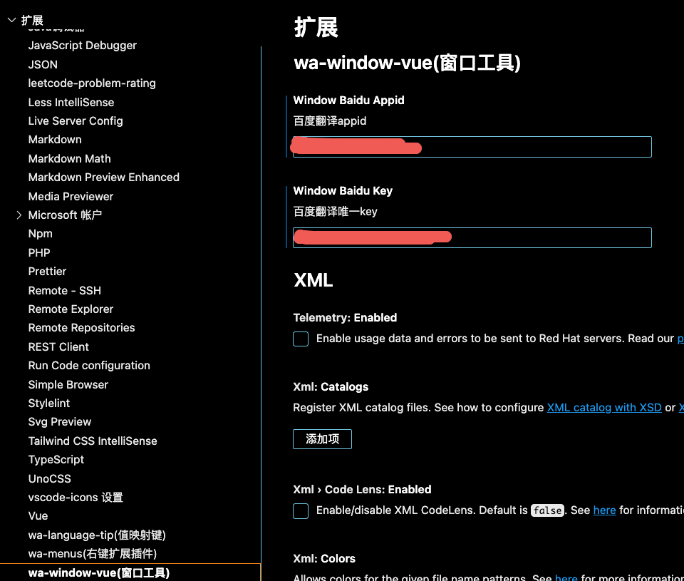

<h1>wa-window-vue</h1>

</p>vscode 窗口工具插件<p>

## 功能说明

### 翻译

文本翻译,支持百度和有道

- 需要在百度翻译后台或有道后台创建应用,获取到 `appId`, `appKey`

- 然后再在设置 → 扩展 → `wa-window-vue`

  

### AES 解密

配置`aesKey`后,输入需要解密的数据点击**解码**得到解密后的数据

### json 转类型声明

将`json`数据转换成`ts`中的类型声明

比如填充上内容

```
{'a': '哈哈'}
```

点击**开始转换**后获得

```
interface RootObject {
  a: string;
}
```
